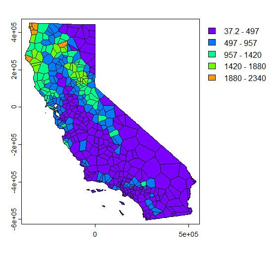

# Spatial Data Analysis

This project contains R code for spatial data analysis, focusing on techniques such as visualization, interpolation, and evaluation of spatial models. The analysis primarily revolves around precipitation data with a focus on California.

## Overview

Spatial data analysis is crucial for understanding geographical patterns and making informed decisions in various fields such as environmental science, urban planning, and agriculture. This repository provides code snippets and techniques to analyze spatial data effectively, with a specific focus on precipitation patterns in California.

## Required Packages

To run the code in this repository, you'll need to install the following R packages:

- `maps`
- `sf`
- `terra`
- `tidyterra`
- `classInt`
- `ggplot2`
- `RColorBrewer`
- `rspat`
- `gstat`

## Usage

1. **Installation**: Install the required R packages mentioned above.
2. **Data Preparation**: Load spatial data and preprocess it as needed.
3. **Analysis**:
   - Visualize spatial outlines.
   - Compute and analyze precipitation patterns.
   - Perform interpolation techniques such as proximity polygons, nearest neighbors interpolation, and inverse distance weighted interpolation.
4. **Evaluation**: Evaluate the performance of interpolation models using cross-validation techniques.
5. **Interpretation**: Understand the generated models and their relative performance compared to null models.

## Analysis/Plots

### Annual Precipitation

*Description: This image shows the annual precipitation distribution across California.*

### Precipitation by Intensity

*Description: This image visualizes precipitation intensity levels in the different counties of California.*

### Precipitation Plot

*Description: This plot illustrates the spatial distribution of precipitation data.*

### Proximity Polygon Plot

*Description: This plot displays proximity polygons generated based on input point locations.*

### Rasterized Plot

*Description: This plot shows the rasterized representation of spatial data.*

## About Me

I'm [Dhruv Jani](https://github.com/optimizedLP). For this project, I ventured into R to explore the fascinating world of spatial data analysis. I enjoy building insightful projects that unravel patterns hidden in data. Feel free to connect with me on GitHub! :rocket:
